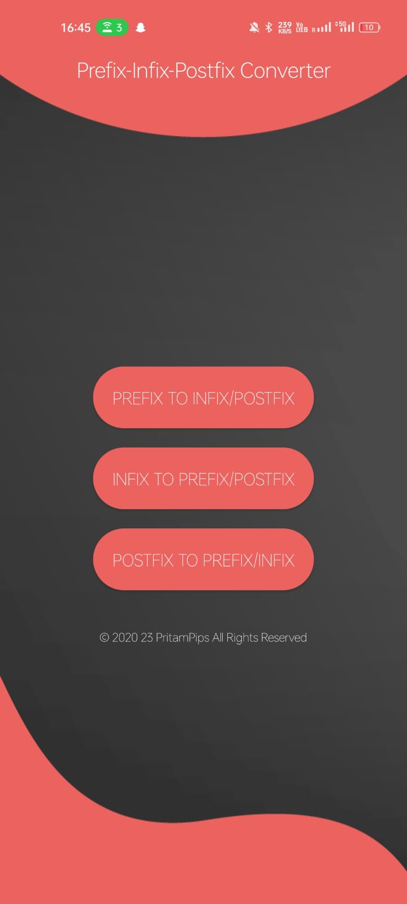
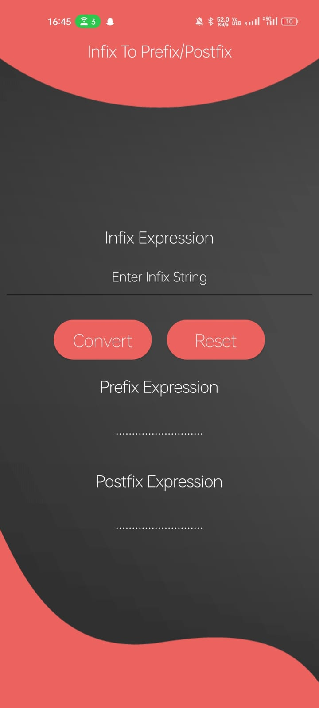
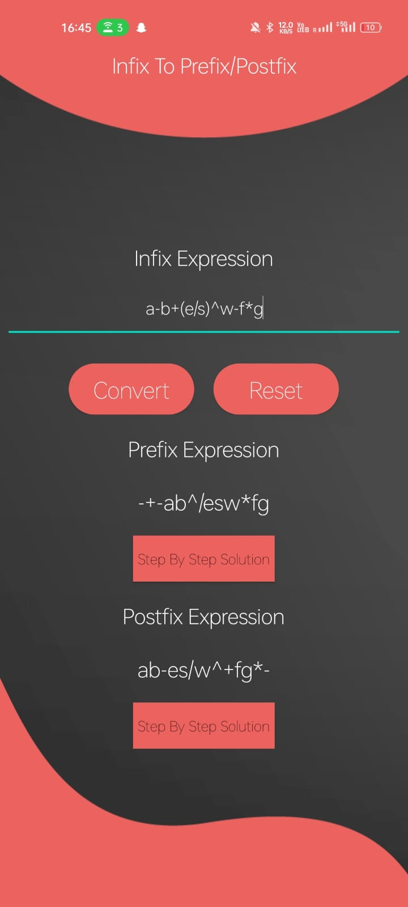
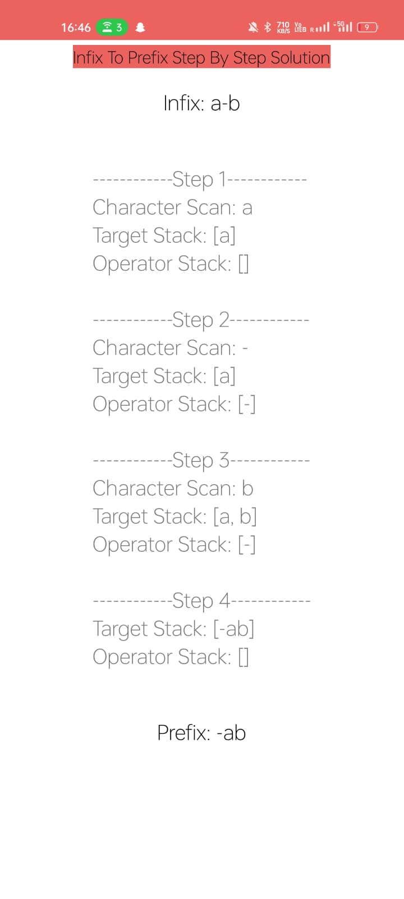

# PrefixInfixPostfixConverter
Prefix-Infix-Postfix Converter: Convert among prefix strings, postfix strings, infix strings step by step. This app validates the input expression and deals with alphabets, digits, (), +, -, *, /, ^,% and $.
You can see step by step solutions for all conversion among infix, prefix and postfix. 
Note: Enjoy seamless experience and perfect output.

## Key Features:
1. Convert infix to prefix (Support Step By Step Solution).
2. Convert infix to postfix (Support Step By Step Solution).
3. Convert prefix to infix (Support Step By Step Solution).
4. Convert prefix to postfix (Support Step By Step Solution).
5. Convert postfix to prefix (Support Step By Step Solution).
6. Convert postfix to infix (Support Step By Step Solution).

# Screenshot of the App

## Authors
* Pritam Mondal 
    * Email <pritammondalpips@gmail.com>
    * Github [@pipspritam](https://github.com/pipspritam "pipspritam profile")
    * Instagram [@pritam_pips](https://www.instagram.com/pritam_pips "Pritam's instagram")
    
## Google Play
Total download till August 2023 <h3> 9.3K </h3> 
Link - [Play Store Link](https://play.google.com/store/apps/details?id=com.prefix_infix_postfix_converter.prefix_infix_postfix_converter)
